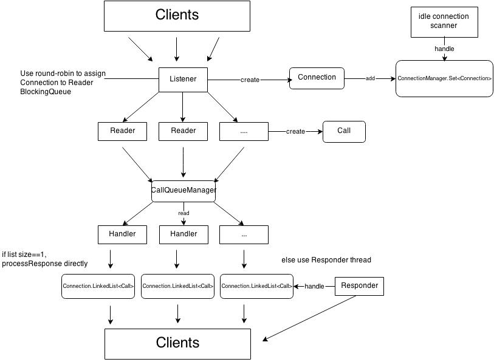

## Hadoop RPC

###线程概览

从线程的整体结构可以看到

* Reader 和 Handler 线程可以配置个数的, 以此来处理大量requests. 参考: HADOOP-6713
* CallQueueManager是一个性能瓶颈, 尤其是采用默认`LinkedBlockingQueue` 情况下. 参考HADOOP-9640
* 对Client的Response默认是在Handler中直接返回, 当在Response过多, 数据量大, 不能一次性处理时, 转移给Responder处理.

线程的执行流程解释

* IPC Server listener
 1. 配置参数: IPC_SERVER_LISTEN_QUEUE_SIZE_KEY(backlogLength 默认 128).
 2. constructor: 绑定端口, 启动全部`IPC Socket Reader`线程, 注册SelectionKey.OP_ACCEPT事件.
 3. 线程开始, 首先启动`IPC Server idle connection scanner` 线程, 调用Selector.select() 没有timeout参数, 如果有connection request就触发doAccept.
 4. doAccept 接收所有的request `while ((channel = server.accept()) != null)`, 在`ConnectionManager`中创建`Connection`, 以round robin形式挑选reader thread, 把connection添加到Reader中的LinkedBlockingQueue.
 5. 特殊处理, 在做doAccept的时候可能会遇到OutOfMemoryError(//TODO什么时候), 这个地方抛出OutOfMemoryError, 主要目的是不让Listener thread挂掉, 让它sleep(1min), 让它继续处理connection request.
* IPC Socket Reader
 1. 配置参数: IPC_SERVER_RPC_READ_THREADS_KEY(默认1), 创建Reader线程的个数. IPC_SERVER_RPC_READ_CONNECTION_QUEUE_SIZE_KEY(默认100), Reader中`LinkedBlockingQueue<Connection> pendingConnections` 容量.
 2. 线程处理: 在方法doRunLoop中处理, 从pendingConnections中得到所有的connection, 将所有channel注册到selector中, 事件是OP_READ, 并把Connection attach到SelectionKey中, 调用Selector.select(), 如果由OP_READ事件, 触发doRead.
 3. doRead: 读取顺序 Rpc-connection header (具体信息参考RpcConstants) --> RpcRequestHeaderProto -->
 IpcConnectionContextProto (refer to IpcConnectionContext.proto) --> 读取具体的 RpcRequestHeaderProto 和 具体的RpcEngine header和data, 组装成Call, 放入CallQueueManager.
* IPC Server handler
 1. 配置参数: DFS_NAMENODE_HANDLER_COUNT_KEY(handlerCount 默认10), 创建Handler线程数量.
 2. 从CallQueueManager 中取出 Call object, 执行RpcInvoker.call(), 此处只涉及到ProtobufRpcEngine, 从`RequestHeaderProto`得到declaringClassProtocolName和clientProtocolVersion, 从protocolImplMapArray(RPC.java)中得到ProtoClassProtoImpl, 从而得到protocolImpl 即是 BlockingService, 再执行`BlockingService.callBlockingMethod(Descriptors.MethodDescriptor method, RpcController null, Message request)` RpcController始终为null.
 3. 组装Response Message 放入Call 中的`ByteBuffer rpcResponse`, 最后放入Connection中的`LinkedList<Call> responseQueue`, 最后Responder.doRespond(call), 如果responseQueue.size == 1, 直接在Handler线程处理, 调用Responder.processResponse
 4. Responder.processResponse: 注意在`Call.rpcResponse ByteBuffer` 一次性没有发送完的情况下, 会将Call object重新放进`responseQueue`, 将channel注册到writerSelector, 事件SelectionKey.OP_WRITE. 此时这个Call剩下的reponse转交给Responder线程处理.
 
* IPC Server Responder
 1. 默认参数PURGE_INTERVAL(15mins), writeSelector等待时间, 也是在Call reponse没有发出的超时时间.
 2. 从writeSelector中取出已经ready的OP_WRITE事件, 执行processResponse. 在间隔时间大于等于PURGE_INTERVAL, 执行doPurge -- > closeConnection(//TODO何种情况下执行doPurge)

* IPC Server idle connection scanner（daemon）
 1. 配置参数: IPC_CLIENT_IDLETHRESHOLD_KEY(idleScanThreshold 默认 4000), IPC_CLIENT_CONNECTION_IDLESCANINTERVAL_KEY(idleScanInterval 默认 10s), IPC_CLIENT_CONNECTION_MAXIDLETIME_KEY(maxIdleTime默认20s), IPC_CLIENT_KILL_MAX_KEY(maxIdleToClose 默认 10 close Idel connection最大数量).
 2. 在 connection数量大于 `idleScanThreshold`, Connection.lastContact > `maxIdleTime`, Connection.idIdle == true, 关闭数量`closed` <= `maxIdleToClose`,  执行connection.close .

